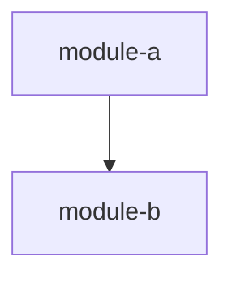

# Module Map

## Overview
{Brief description of the module decomposition}

## Modules

| Module | Complexity | Repos | Dependencies |
|--------|-----------|-------|--------------|

## Dependency Graph

## Implementation Order
1. {module} — {why first}
2. {module} — {depends on 1}
